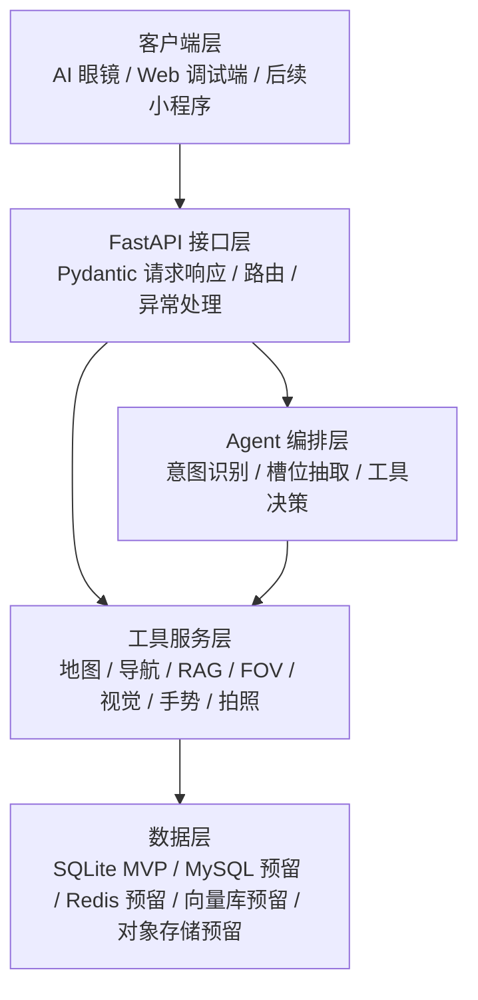
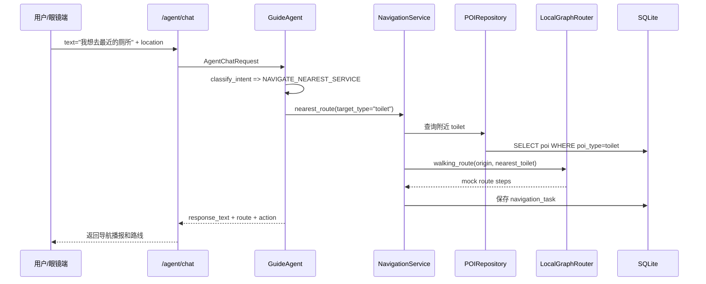
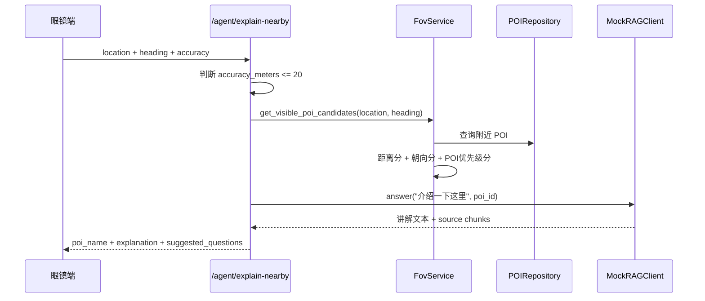
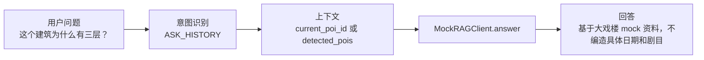
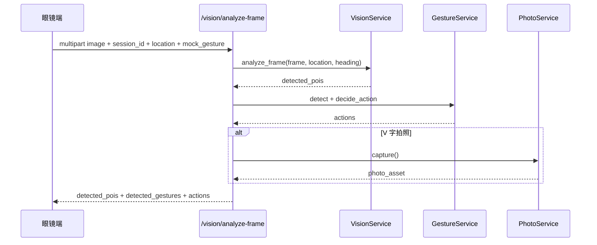
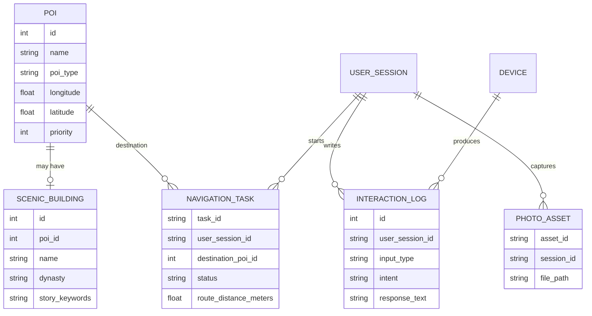
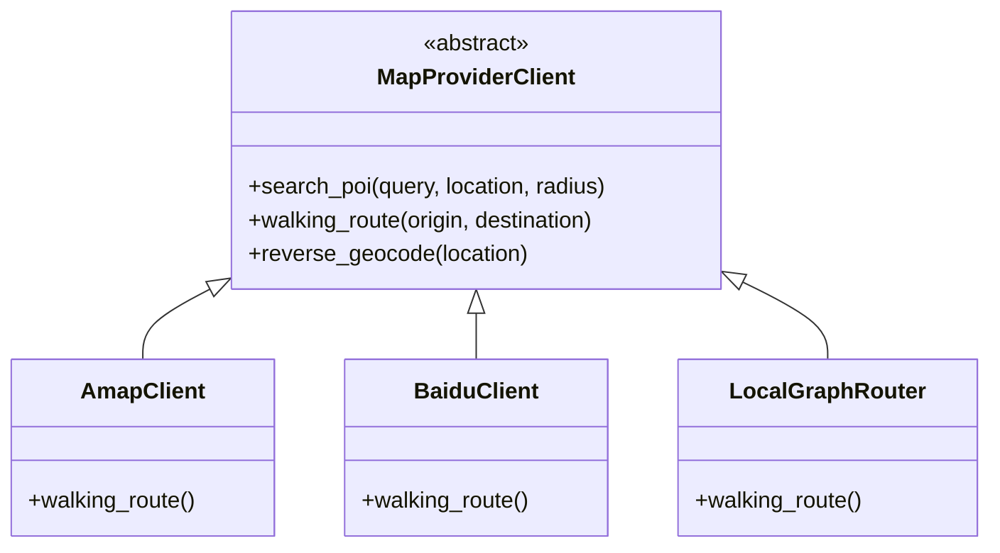

# 颐和园 AI 导览 MVP 项目总览

这份文档帮助你最快理解当前项目：它实现了一个 Python + FastAPI 后端 MVP，用来演示“对话导航、附近景点讲解、RAG 问答、眼镜画面识别、手势控制”的最小闭环。

## 1. 项目一句话

游客通过 AI 导览眼镜或调试端上传位置、朝向、画面和语音文本，后端判断游客想做什么，再调用 POI、路线、RAG、视觉、手势、拍照等服务，返回可播报、可渲染、可继续追问的结果。

当前重点不是接入真实地图、真实视觉模型或真实向量库，而是先把所有接口、分层和替换点搭好，让后续真实能力可以逐个换进去。

## 2. 已实现核心能力

| 能力 | 用户场景 | 主要接口 |
| --- | --- | --- |
| 路线导览 | “我想去厕所”“带我去德和园” | `POST /api/v1/navigation/nearest`、`POST /api/v1/navigation/route`、`POST /api/v1/agent/chat` |
| 附近景点讲解 | 用户看向德和园大戏楼，系统自动讲解 | `POST /api/v1/agent/explain-nearby` |
| RAG 历史问答 | “这个建筑为什么有三层？” | `POST /api/v1/rag/answer`、`POST /api/v1/agent/chat` |
| 眼镜画面理解 | 上传图片，返回 mock 景点识别 | `POST /api/v1/vision/analyze-frame` |
| 手势交互 | V 字拍照、指向导航、握拳停止 | `POST /api/v1/vision/analyze-frames`、`POST /api/v1/vision/gesture` |
| 拍照记录 | 创建照片资产记录 | `POST /api/v1/photo/capture` |

## 3. 总体架构



### 架构解读

- **客户端层**：现在可以用 Swagger、curl 或 VS Code 终端模拟请求；后续替换成眼镜端、小程序或管理后台。
- **接口层**：所有 HTTP 接口都在 `app/api/v1/routes/`，请求和响应统一使用 `app/schemas/` 中的 Pydantic 模型。
- **Agent 层**：`GuideAgent` 负责把自然语言转成具体动作，例如最近厕所导航、景点讲解、历史问答、拍照、停止导航。
- **服务层**：真正做业务能力的地方。地图、RAG、视觉、手势都做了抽象或 mock，后续容易替换。
- **数据层**：当前默认 SQLite，方便本地启动；保留 MySQL、Redis、向量库、对象存储接入位置。

## 4. 目录结构速读

```text
GuideTour/
  app/
    main.py                         FastAPI 入口，注册路由，启动时初始化数据库和 seed
    core/                           配置、异常、安全、日志
    api/v1/routes/                  HTTP API 路由
    schemas/                        Pydantic 请求/响应模型
    models/                         SQLAlchemy 数据模型
    db/                             数据库 session 和初始化
    repositories/                   数据访问层
    services/
      agent/                        对话 Agent、意图识别、工具封装
      map/                          地图 Provider 抽象、高德/百度占位、本地路线
      navigation/                   导航任务、路线状态更新、停止导航
      location/                     实时位置内存存储、FOV 视野判断
      rag/                          RAG 抽象和 MockRAGClient
      vision/                       画面识别 Mock、手势防误触
      photo/                        拍照资产记录
    workers/                        后续后台任务预留
  scripts/
    seed_poi.py                     初始化 POI 测试数据
    run_dev.py                      本地启动脚本
  tests/                            pytest 测试
  README.md                         启动和 API 示例
  PROJECT_OVERVIEW.md               当前这份项目总览
```

## 5. 核心请求链路

### 5.1 用户说“我想去最近的厕所”



结果示例：

```json
{
  "intent": "NAVIGATE_NEAREST_SERVICE",
  "response_text": "已为你规划去厕所A的步行路线，全程约59米，预计1分钟。请沿当前道路向前步行。",
  "actions": [{"type": "navigation_started", "task_id": "nav_xxx"}]
}
```

### 5.2 用户看向德和园大戏楼，触发讲解



FOV 候选评分简化公式：

```text
score = 距离分 * 0.35 + 朝向分 * 0.35 + POI优先级分 * 0.15 + 视觉置信度分 * 0.15
```

### 5.3 用户追问“这个建筑为什么有三层？”



当前 RAG 是 mock，实现位置在：

```text
app/services/rag/mock_rag_client.py
```

后续公司提供真实向量库时，优先替换 `RAGClient` 的实现，而不是改 Agent。

### 5.4 上传画面并识别手势



手势防误触规则已经在 `GestureService` 中实现了 MVP 版：

- 置信度低于 `0.75` 不触发。
- 持续时间低于 `800ms` 不触发。
- 同一手势触发后有 `3s` 冷却。
- 导航、停止导航这类高影响动作标记为需要确认。

## 6. 数据模型关系



说明：`UserSession` 和 `Device` 当前模型已预留，但 MVP 里主要通过 `session_id` 字符串贯穿链路，方便调试。

## 7. 地图 Provider 设计



当前策略：

- 业务层只调用 `MapProviderClient`，不直接依赖高德或百度。
- 没有真实地图 Key 时，`AmapClient` 和 `BaiduClient` 会回退到 `LocalGraphRouter`。
- 内部统一使用 `lng, lat`。
- 坐标适配函数位于 `app/services/map/coordinate.py`：
  - 高德：`to_amap_point` 输出 `lng,lat`
  - 百度：`to_baidu_point` 输出 `lat,lng`

## 8. Agent 意图支持

当前意图识别是规则版，位置在：

```text
app/services/agent/intent.py
```

支持意图：

| 意图 | 触发示例 | 动作 |
| --- | --- | --- |
| `NAVIGATE_NEAREST_SERVICE` | 我想去最近的厕所 | 查最近 POI 并规划路线 |
| `NAVIGATE_TO_POI` | 带我去德和园 | 查询目的地并规划路线 |
| `EXPLAIN_NEARBY` | 介绍一下这里 | 根据位置和朝向找景点，调用 RAG |
| `ASK_HISTORY` | 这个建筑为什么有三层 | 结合当前 POI 调 RAG 问答 |
| `TAKE_PHOTO` | 拍照 | 创建照片记录 |
| `STOP_NAVIGATION` | 停止导航 | 取消当前导航任务 |
| `UNKNOWN` | 其他 | 返回能力提示 |

后续如果接入大模型或 LangGraph，可以保留 `GuideAgent.chat()` 的输入输出，把内部规则替换成 LLM 节点。

## 9. 启动与验证

### 安装依赖

```cmd
venv\Scripts\python -m pip install -r requirements.txt
```

### 初始化 POI

```cmd
venv\Scripts\python -m scripts.seed_poi
```

### 启动服务

```cmd
venv\Scripts\python -m uvicorn app.main:app --host 127.0.0.1 --port 8000 --reload
```

如果 `8000` 已被占用，可以换端口：

```cmd
venv\Scripts\python -m uvicorn app.main:app --host 127.0.0.1 --port 8010 --reload
```

### 打开接口文档

```text
http://127.0.0.1:8000/docs
```

### 运行测试

```cmd
venv\Scripts\python -m pytest -q
```

当前测试结果：

```text
8 passed
```

## 10. 最快演示路径

按这个顺序演示，可以覆盖整个 MVP 闭环。

### 1. 健康检查

```cmd
curl http://127.0.0.1:8000/health
```

### 2. 最近厕所导航

```cmd
curl -X POST http://127.0.0.1:8000/api/v1/navigation/nearest -H "Content-Type: application/json" -d "{\"session_id\":\"s001\",\"origin\":{\"lng\":116.2699,\"lat\":39.9991},\"target_type\":\"toilet\",\"radius_meters\":1000}"
```

### 3. 对话触发导航

```cmd
curl -X POST http://127.0.0.1:8000/api/v1/agent/chat -H "Content-Type: application/json" -d "{\"session_id\":\"s001\",\"device_id\":\"glass001\",\"text\":\"我想去最近的厕所\",\"location\":{\"lng\":116.2699,\"lat\":39.9991},\"heading\":85}"
```

### 4. 自动讲解附近景点

```cmd
curl -X POST http://127.0.0.1:8000/api/v1/agent/explain-nearby -H "Content-Type: application/json" -d "{\"session_id\":\"s001\",\"device_id\":\"glass001\",\"location\":{\"lng\":116.2728,\"lat\":39.99955},\"heading\":90,\"accuracy_meters\":5}"
```

### 5. RAG 追问

```cmd
curl -X POST http://127.0.0.1:8000/api/v1/rag/answer -H "Content-Type: application/json" -d "{\"query\":\"这个建筑为什么有三层？\",\"poi_id\":2}"
```

### 6. V 字手势拍照

```cmd
curl -X POST http://127.0.0.1:8000/api/v1/vision/analyze-frames -H "Content-Type: application/json" -d "{\"session_id\":\"s001\",\"device_id\":\"glass001\",\"frame_ids\":[\"f1\"],\"mock_gesture\":\"take_photo\"}"
```

## 11. 后续开发建议

优先级建议：

1. **接入真实 Redis**：替换 `InMemoryLocationStore`，保存实时位置、导航状态、手势冷却和重复讲解记录。
2. **补 Alembic 迁移**：当前 MVP 用 `create_all`，后续多人协作需要正式 migration。
3. **接真实地图 API**：把 `AmapClient`、`BaiduClient` 从占位改为真实 HTTP 调用，保留本地路网 fallback。
4. **替换 RAG**：实现公司向量库版本的 `RAGClient`。
5. **替换 Vision/Gesture**：接入真实建筑识别、手势识别模型。
6. **Agent 升级为 LangGraph**：当前规则版稳定可演示，后续可替换成节点式工作流。
7. **增强导航偏航判断**：基于 polyline 最近点距离、连续偏航次数、定位精度做更稳的判断。

## 12. 当前项目边界

已经完成：

- 最小闭环接口。
- 可运行服务。
- 可测试 POI seed。
- Mock 地图、RAG、视觉、手势。
- 8 个自动化测试。

暂未完成：

- 真实 MySQL/Redis 运行依赖强绑定。
- 真实高德/百度 API 调用。
- 真实向量数据库。
- 真实图像识别和手势模型。
- WebSocket 实时推送。
- 管理后台。

这些未完成项都已经留了接口和目录位置，后续可以分模块替换，不需要推倒重来。
